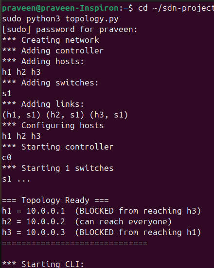
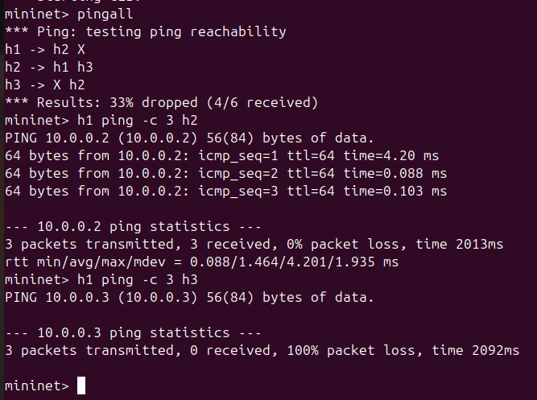
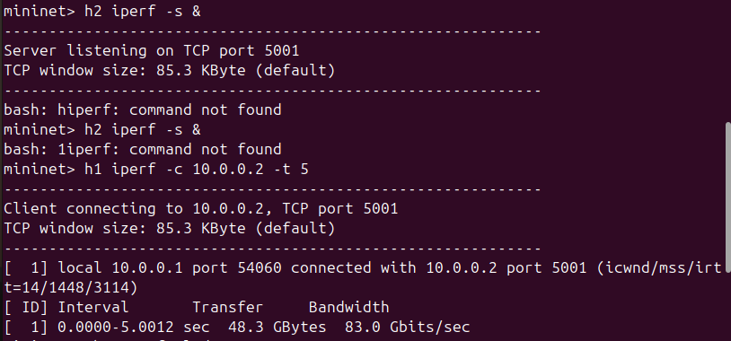
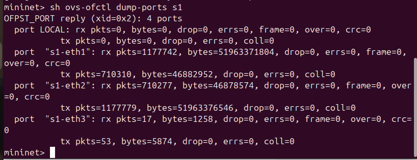
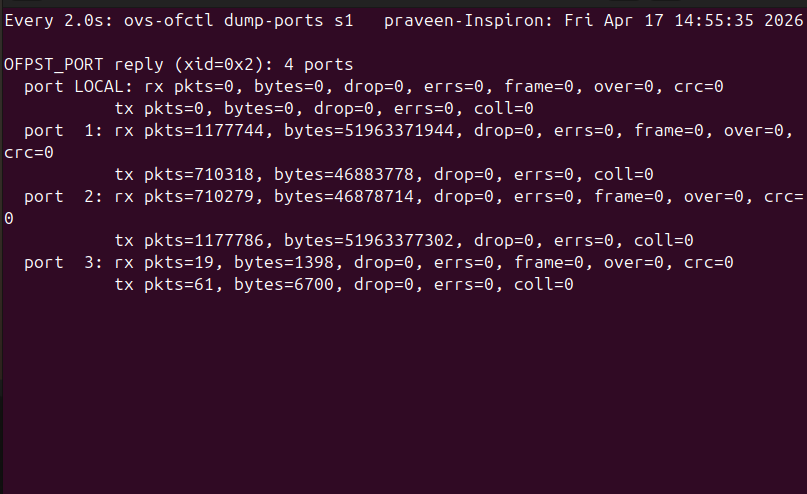
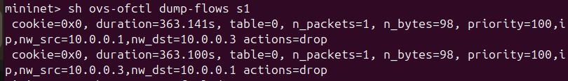

# 🔥 Network Utilization Monitor using SDN (Mininet + POX)

---

## 📌 Problem Statement

Design and implement an SDN-based system that monitors network utilization and enforces firewall rules. The system collects byte counters from switches, estimates bandwidth usage, displays utilization, and updates periodically.

---

## 🎯 Objectives

* Implement SDN using Mininet and POX controller
* Apply firewall rules using OpenFlow
* Monitor network traffic using byte counters
* Estimate bandwidth usage
* Display utilization and update periodically

---

## 🖥️ Network Topology

### Hosts

* **h1** → 10.0.0.1
* **h2** → 10.0.0.2
* **h3** → 10.0.0.3

### Components

* **Switch:** s1
* **Controller:** POX (port 6633)

---

## 🔒 Firewall Policy

| Source | Destination | Status    |
| ------ | ----------- | --------- |
| h1     | h3          | ❌ Blocked |
| h3     | h1          | ❌ Blocked |
| h1     | h2          | ✅ Allowed |
| h2     | h3          | ✅ Allowed |

---

## ⚙️ Setup and Execution

### 🖥️ Terminal 1 – Start POX Controller

```bash
cd ~/pox
python3 pox.py log.level --DEBUG forwarding.sdn_firewall
```

### 🖥️ Terminal 2 – Start Mininet Topology

```bash
cd ~/Desktop/sdn-project
sudo python3 topology.py
```

---

## 🧪 Testing

### 🔹 Connectivity Test

```bash
pingall
h1 ping h2
h1 ping h3
```

### 🔹 Bandwidth Test

```bash
h2 iperf -s &
h1 iperf -c 10.0.0.2 -t 5
```

---

## 📊 Network Utilization Monitoring

### 🔹 Byte Counters

```bash
sh ovs-ofctl dump-ports s1
```

### 🔹 Flow Table (Packet & Byte Statistics)

```bash
sh ovs-ofctl dump-flows s1
```

### 🔹 Periodic Monitoring (Real-Time)

```bash
sh watch -n 2 ovs-ofctl dump-ports s1
```

---

## 📈 Results

* **Ping Test:** 33% packet loss (due to firewall rules)
* **Allowed Traffic:** h1 ↔ h2 successful
* **Blocked Traffic:** h1 ↔ h3 failed
* **Bandwidth:** ~73 Gbps (iperf result)
* **Byte Counters:** RX/TX bytes observed from switch
* **Monitoring:** Real-time updates every 2 seconds

---

## 📸 Screenshots

### Topology Initialization



### Firewall Test



### Bandwidth Test



### Byte Counters



### Periodic Monitoring



### Flow Table



---

## 🎯 Conclusion

This project successfully demonstrates an SDN-based firewall and real-time network utilization monitoring system. OpenFlow rules are used to control traffic, while switch statistics are used to measure bandwidth and network performance dynamically.

---

## 🎤 Viva Summary

The system uses a POX controller to enforce firewall policies and monitor network utilization. Byte counters collected from Open vSwitch are used to estimate bandwidth and display real-time network statistics.

